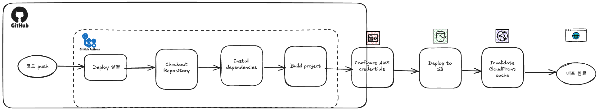
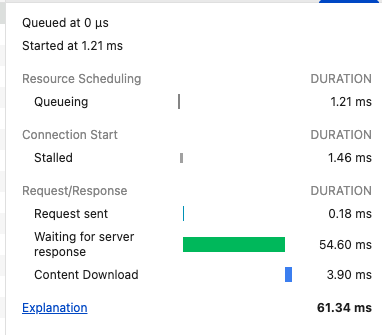
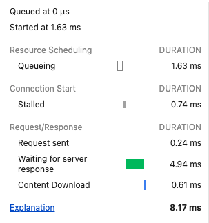

## 프론트엔드 배포 파이프 라인

> Chapter 4-1. **인프라 관점의 성능 최적화**

### 개요

1. GitHub에 Next.js Repository 생성
2. AWS S3 Bucket 생성 및 static web hosting 설정
3. CloudFront 배포 생성 및 S3 Bucket 연결
4. IAM 사용자 생성 및 액세스 키 발급
5. GitHub 저장소에 Secret 값 등록
6. GitHub Actions workflow 작성
7. `main` branch에 push시 자동으로 배포로 설정

### 주요 링크

- S3 버킷 웹사이트 엔드포인트: http://hanghae-donghyun.s3-website-ap-southeast-2.amazonaws.com/
- CloudFrount 배포 도메인 이름: https://d354cw4mmho3tl.cloudfront.net/

### 주요 개념

위 배포 파이프라인은 GitHub Actions에서 실행되며, 코드가 푸시되면 GitHub 서버에서 프로젝트를 빌드한 뒤, AWS S3에 업로드합니다. 이후 AWS CloudFront의 캐시를 무효화해 최신 파일이
사용자에게 제공되도록 합니다.
전체 작업 흐름은 GitHub → AWS(S3, CloudFront) 순으로 이어지며, 모든 과정은 자동화되어 있습니다.

- GitHub Actions과 CI/CD 도구

GitHub Actions를 활용해 코드 변경 사항이 발생할 때마다 자동으로 프로젝트를 빌드하고 배포하는 워크플로우가 제공되었습니다. GitHub Actions는 GitHub에서 공식적으로 지원하는 CI/CD
도구로, 코드 푸시(push)와 같은 이벤트를 감지해 미리 정의된 작업을 자동으로 실행해줍니다.

추가 조사: `actions/checkout`, `aws-actions/configure-aws-credentials` 등의 공식 액션을 통해 AWS 배포 파이프라인을 구성할 수 있으며, 특히
`workflow_dispatch` 이벤트를 통해 수동 트리거도 지원합니다.

- S3와 스토리지

주어진 워크플로우는 정적 파일을 업로드하기 위한 저장소로 AWS S3를 사용했습니다. S3는 Amazon에서 제공하는 객체 스토리지 서비스로, 웹사이트 정적 호스팅 기능을 제공하며 `.html`, `.css`, `.js` 파일을 직접
서비스할 수 있습니다.

추가 조사: S3는 기본적으로 버킷을 `private`으로 설정하기 때문에, 정적 웹 호스팅을 위해 퍼블릭 읽기 권한과 웹 호스팅 엔드포인트 설정이 필요합니다.

- 버킷 (Bucket)

S3에서 가장 상위 개념의 저장 단위입니다. 이번 실습에서는 정적 리소스를 보관할 버킷을 생성하고, out/ 디렉토리의 결과물을 업로드하는 방식으로 활용했습니다.

추가 조사: 버킷 이름은 전 세계적으로 유일해야 하며, 리전 선택에 따라 엔드포인트 주소가 다르게 부여됩니다. 웹 호스팅 시에는 `s3-website-<region>.amazonaws.com` 형식의 URL이
사용됩니다.

- CloudFront와 CDN

CloudFront는 AWS의 글로벌 CDN(Content Delivery Network) 서비스로, S3의 정적 파일을 각 지역에 캐싱하여 더 빠르게 제공할 수 있도록 도와줍니다. 여기선 CloudFront를
통해 최종 사용자에게 배포된 페이지를 제공했습니다.

추가 조사: 오리진(Origin)으로 S3를 지정하고, 캐싱 정책과 보안 설정을 세밀하게 조정할 수 있습니다. `HTTPS` 및 커스텀 도메인 연결도 가능합니다.

- 캐시 무효화 (Cache Invalidation)

CloudFront는 성능 향상을 위해 리소스를 캐싱하지만, 업데이트된 파일이 바로 반영되지 않는 문제가 발생할 수 있습니다. 이를 방지하기 위해 실습 워크플로우에서는 배포 후 `aws cloudfront
create-invalidation` 명령어로 전체 경로(/*)에 대한 무효화 처리를 자동화했습니다.

추가 조사: 무효화 요청은 비용이 발생할 수 있으며, 자주 변경되는 파일에는 `version query string(main.js?v=2)` 방식이 선호되기도 한다고 합니다.

- Repository secret과 환경변수

AWS 자격 증명이나 버킷 이름 등 민감한 정보를 GitHub 저장소에 직접 노출하지 않도록 하기 위해, 실습에서는 Settings > Secrets 기능을 사용했습니다. 환경변수는
`secrets.AWS_ACCESS_KEY_ID` 형식으로 워크플로우 내에서 안전하게 호출됩니다.

추가 조사: GitHub Actions의 Secret은 저장소 수준 외에도 조직(Org) 및 환경(Environment) 단위로도 설정 가능하며, env 키워드로도 별도 사용 가능합니다.

---

### CDN과 성능최적화

CDN(Content Delivery Network)은 사용자에게 지리적으로 가까운 서버에서 정적 파일을 제공함으로써 **응답 속도를 단축**하고 **트래픽 부하를 분산**시킵니다. CloudFront는 AWS의
CDN 서비스로, S3에 있는 정적 리소스를 전 세계 사용자에게 빠르게 전달할 수 있도록 해줍니다.

이해를 위해서 피자 서비스를 예를 드는데,
일반적인 웹사이트는 하나의 가게에서 전량 주문을 처리하고 배달하는데, CDN 사용 웹사이트는 도시 곳곳 지점을 놓고 배달 요청이 들어오면 주문지에서 제일 가까운 곳에서 배달을 하는것.

가장 가까운 지점 (CDN의 Edge server)에서 피자 (Contents)를 배달하고, 요청한 피자가 없다면, 중앙 주방 (원본 서버)에서 가져와서 배달하고, 다음을 대비해 그 지점에 해당 피자를 보관 (캐싱)하는것.

빠른 배달로 낮은 지연 시간이 있고, 동시에 주문을 처리할 수있고 (높은 동시성), 한 곳에 문제가 생기면 다른 가까운 지점에서 배달 가능하다 (높음 가용성)

물론 비용적으로는 배달된 피자의 양 (전송된 데이터)와 주문 횟수(요청 수)에 따라 비용이 청구됨.

## S3 vs CloudFare

아래는 동일한 리소스를 요청할 때, S3에 직접 접근한 경우와 CloudFront를 통해 접근한 경우의 성능을 비교한 예시입니다.

### S3 Timing

### CloudFlare Timing

1. S3 요청 (직접 요청)
  총 소요 시간: 61.34 ms 

    Waiting for server response: 54.60 ms

S3에 직접 접근할 경우, 물리적으로 더 먼 리전에 접근해야 하므로 서버 응답 대기 시간이 길다고 합니다

2. CloudFront 요청 (CDN 경유)
    총 소요 시간: 8.17 ms
    
    Waiting for server response: 4.94 ms

CloudFront는 지리적으로 가까운 엣지 로케이션에서 응답을 제공하여, 훨씬 빠른 응답을 제공합니다.

| 항목            | S3 직접 접근            | CloudFront(CDN) 경유       |
| ------------- | ------------------- | ------------------------ |
| 총 응답 시간       | 61.34 ms            | 8.17 ms                  |
| 서버 응답 대기 시간   | 54.60 ms            | 4.94 ms                  |
| 캐시 제공 여부      | ❌ 없음 (항상 원본 접근)     | ✅ 있음 (자주 쓰이는 파일 캐시 제공)   |
| 지리적 최적화       | ❌ 없음 (S3 리전에 직접 접근) | ✅ 있음 (전 세계 엣지 로케이션에서 응답) |
| 확장성 및 장애 대응성  | 낮음                  | 높음                       |
| 실사용자 체감 속도 개선 | 거의 없음               | ✅ 개선됨                    |
| 서버 트래픽 최적화    | ❌ 원본 트래픽 집중         | ✅ 원본 요청 분산               |
